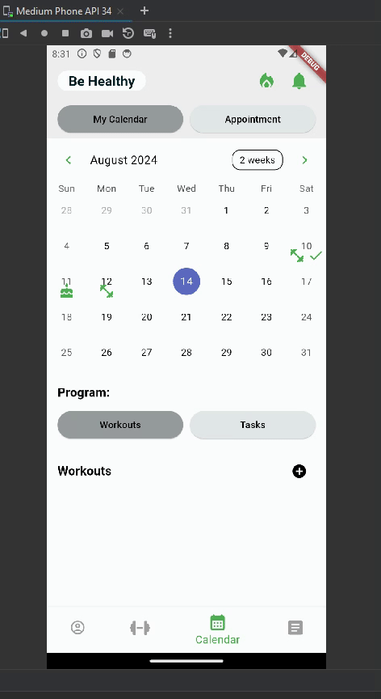
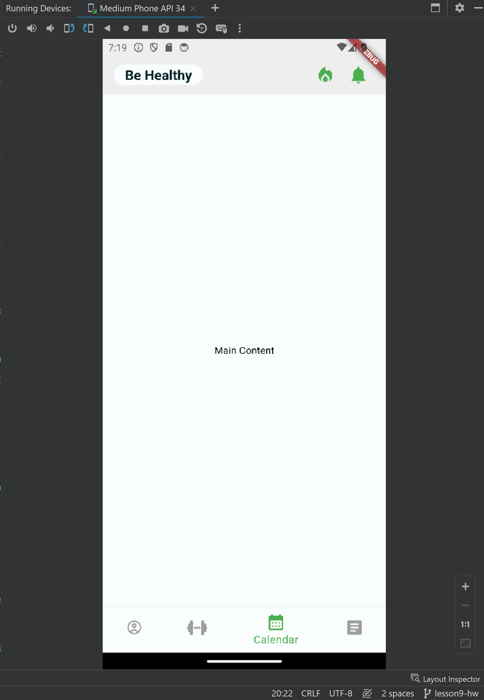
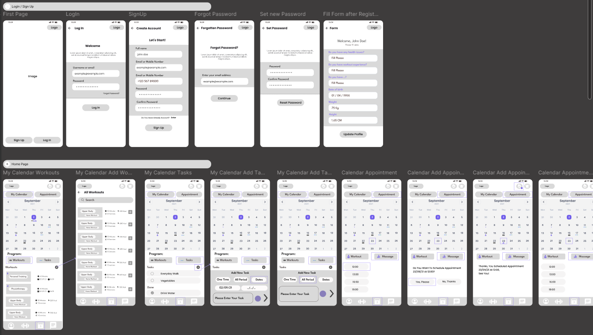
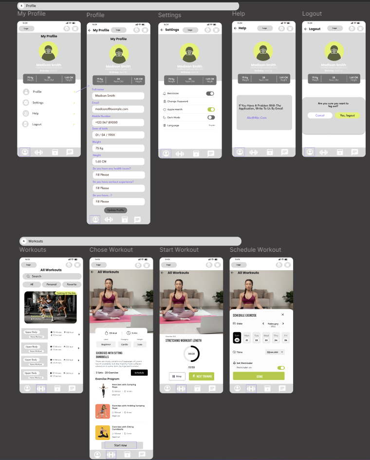
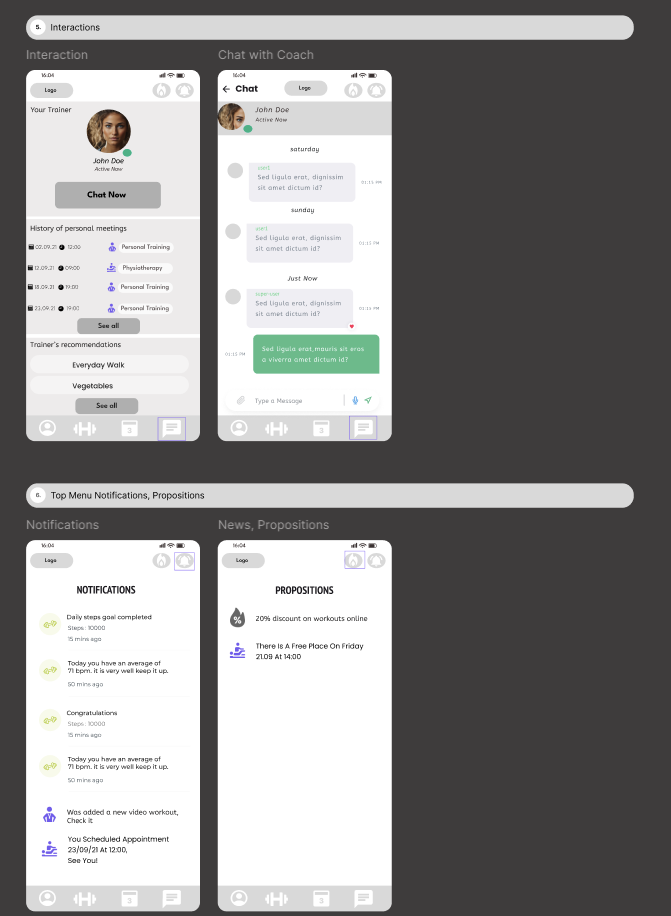

# BeHealthy Project

## HW #10

## HW #9

## Опис проекту
Мобільний додаток для управління тренуваннями, який дозволяє користувачам планувати відео тренування та завдання, бронювати сесії з тренером, переглядати відео-тренування, відстежувати прогрес, отримувати сповіщення та спілкуватися з тренером.
## Функції
- **Особистий календар:** Додавання відео тренувань, завдань та відмічання їх виконаними.
- **Календар тренера:** Перегляд вільних дат та часу для бронювання особистих тренувань з автоматичними сповіщеннями.
- **Особистий кабінет:** Збереження особистих даних, анкети здоров'я, налаштувань та підтримки.
- **Відео-тренування:** Перегляд, додавання в улюблені та планування періоду тренувань.
- **Сповіщення:** Оновлення щодо тренувань, завдань, вільних місць та повідомлень.
- **Чат з тренером:** Текстові, аудіо, відео та фото повідомлення з видимістю статусу онлайн тренера.
- **Історія офлайн відвідувань:** Збереження історії відвідувань тренувань.

## Project Description
A mobile app for managing workouts that allows users to schedule video workouts and tasks, book sessions with a trainer, view video workouts, track progress, receive notifications, and communicate with the trainer.
## Features
- **Personal Calendar: Add video workouts and tasks, and mark them as completed.
- **Trainer Calendar: View available dates and times for booking personal training sessions with automatic notifications.
- **Personal Profile: Store personal data, health questionnaires, settings, and support.
- **Video Workouts: View, add to favorites, and plan the training period in advance.
- **Notifications: Updates on workouts, tasks, available slots, and messages.
- **Chat with Trainer: Text, audio, video, and photo messages with visibility of the trainer's online status.
- **Offline Visit History: Store the history of training visits.

## Figma Design
[Figma Design Link](https://www.figma.com/design/bJhHpSuNTnsS0zhBUFwkqZ/Scheme-BeHealthy?node-id=0-1&t=glaoYatiZ6OmaP3x-1)

## Screenshots
### Login, Home Page(Calendar)

### Profile, Workouts

### Interactions, Top Menu(Notifications, Propositions)

## Git repository:
https://github.com/AnastasiiaRudch/behealthyproject

## Getting Started

This project is a starting point for a Flutter application.

A few resources to get you started if this is your first Flutter project:

- [Lab: Write your first Flutter app](https://docs.flutter.dev/get-started/codelab)
- [Cookbook: Useful Flutter samples](https://docs.flutter.dev/cookbook)

For help getting started with Flutter development, view the
[online documentation](https://docs.flutter.dev/), which offers tutorials,
samples, guidance on mobile development, and a full API reference.
